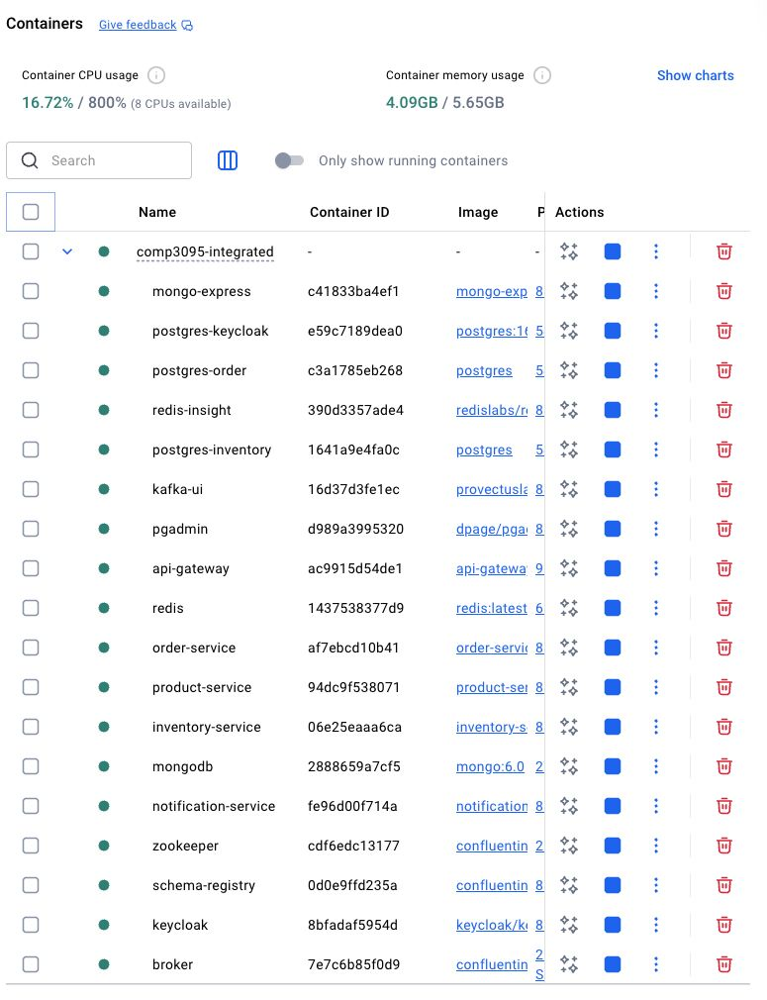
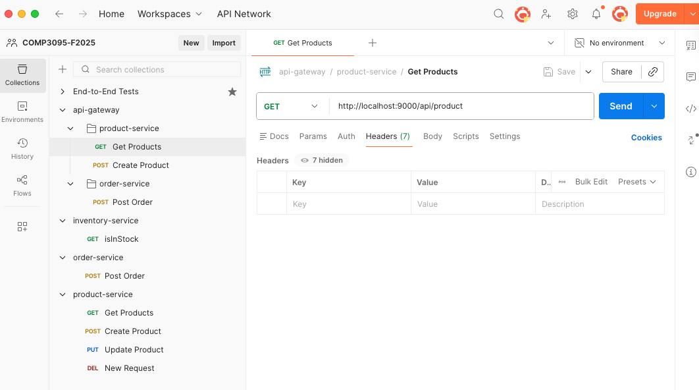
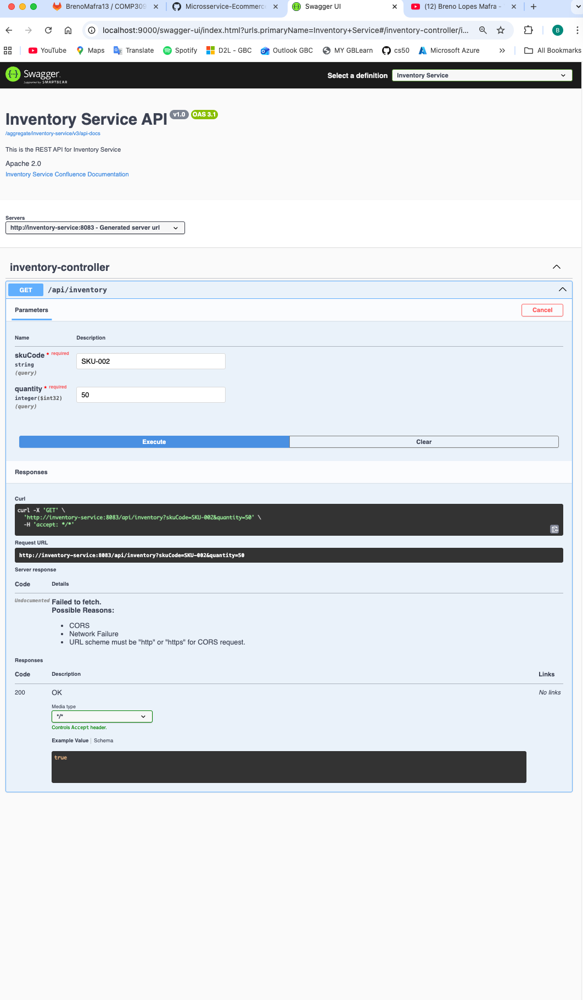
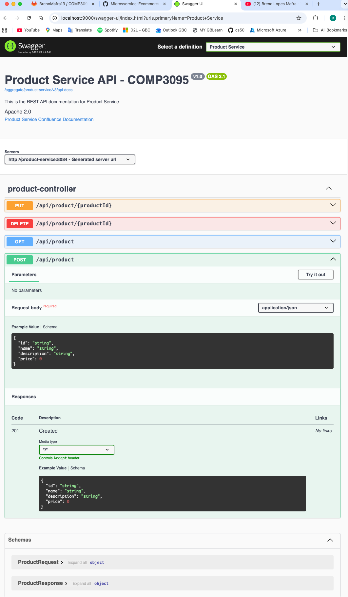

# Order Management System (Full-Stack Project)
Author: Breno Lopes Mafra, Computer Programmer and Analyst

> Full-stack project with Java microservices, API gateway, messaging, and ready-to-use test UI (Swagger + Postman collection). Dockerized end-to-end stack for APIs, data stores, broker, and visual tools.

## Videos (demo)
- Part 1 (architecture, tooling, local/docker setup): https://youtu.be/vuW-PBnc7YY?si=l4QQ_h5da6_qYlPC  
- Part 2 (API flow, gateway routing, product→inventory→order, Kafka event + email): https://youtu.be/DFeRhN09lWI?si=BvXiCdQU-EaMF_AP

## Overview
- **Front/Test UI**: Swagger UI aggregated in the API Gateway (http://localhost:9000/swagger-ui) + Postman collection for the whole flow.
- **Backend**: Spring Boot microservices (product, inventory, order, notification) behind an API Gateway (Spring Cloud Gateway MVC + Resilience4J + JWT/Keycloak).
- **Messaging**: Kafka + Schema Registry (Confluent) with Avro `OrderPlacedEvent` and email consumer.
- **Data**: MongoDB (products), Redis cache, PostgreSQL (inventory/order) with Flyway, Keycloak (Postgres) for identity.
- **Observability/Tools**: Mongo Express, Redis Insight, pgAdmin, Kafka UI.

## Tech Stack
- **Services/Ports**: api-gateway (9000), product-service (8084), inventory-service (8083), order-service (8082), notification-service (8085)
- **Infra**: Kafka + Schema Registry + Kafka UI (8086), Zookeeper, Keycloak (8080), MongoDB (27017) + Mongo Express (8081), Redis + Redis Insight (8001), Postgres (5433/5434) + pgAdmin (8888)
- **Languages/Frameworks**: Java 17, Spring Boot 3.5.x, Spring Cloud Gateway MVC, Resilience4J, Spring Kafka (Avro), Spring Mail
- **Data/Schema**: MongoDB, Redis cache, PostgreSQL + Flyway, Avro shared schema module (`shared-schema`)
- **Build/Tests**: Gradle 8, Testcontainers, RestAssured, JUnit 5

## End-to-end Flow
Client → **API Gateway** (JWT + circuit breaker) →  
→ **product-service** (Mongo + Redis cache)  
→ **order-service** (REST client + Resilience4J) calls **inventory-service** (Postgres)  
→ **order-service** publishes `OrderPlacedEvent` (Avro) to **Kafka**  
→ **notification-service** consumes and sends email.

## Relevant Screenshots
- Docker Desktop with containers  
  
- Postman collection  
  
- Inventory Swagger  
  
- Order Swagger  
  
- Product Swagger  
  

## Quick start (Docker Compose - recommended)
1) From repo root: `docker-compose -p comp3095-integrated -f docker-compose.yml up -d --build`
2) Gateway entry: http://localhost:9000 (Swagger at `/swagger-ui`)
3) Helpful UIs: Mongo Express http://localhost:8081, Redis Insight http://localhost:8001, pgAdmin http://localhost:8888, Kafka UI http://localhost:8086, Keycloak http://localhost:8080 (admin/password)
4) In Keycloak, create/import realm `spring-microservices-security-realm` and a client for the gateway (JWT required for protected routes).
5) Tear down: `docker-compose -p comp3095-integrated -f docker-compose.yml down`

## Local dev (without Docker)
Prereqs: Java 17; Postgres on 5433 (inventory) and 5434 (orders); MongoDB on 27017 with admin/password; Redis on 6379; Kafka + Schema Registry reachable (compose in `docker/standalone/kafka`).
- Update `application.properties` if you change ports/credentials.
- Run in separate terminals:
  - `./gradlew :product-service:bootRun`
  - `./gradlew :inventory-service:bootRun`
  - `./gradlew :order-service:bootRun`
  - `./gradlew :notification-service:bootRun`
  - `./gradlew :api-gateway:bootRun`
- Always call through the gateway: http://localhost:9000.

## Main endpoints
- Product: `POST /api/product`, `GET /api/product`, `PUT /api/product/{id}`, `DELETE /api/product/{id}`
- Inventory: `GET /api/inventory?skuCode=SKU&quantity=1` → boolean
- Order: `POST /api/order` (checks inventory, publishes Kafka)  
  Example:
  ```json
  {
    "skuCode": "SKU_001",
    "price": 10.50,
    "quantity": 1,
    "userDetails": {
      "email": "user@example.com",
      "firstName": "Test",
      "lastName": "User"
    }
  }
  ```
- Notification: consumes `order-placed` and emails `userDetails.email`.

## Build & Tests
- Build: `./gradlew clean build`
- Tests (Testcontainers): `./gradlew test`

## Data & seeds
- Mongo/Redis init: `docker/integrated/mongo/init`, `docker/integrated/redis/init`
- Postgres init: `docker/integrated/postgres/**/init/init.sql` (order/inventory); data persists under `docker/integrated/postgres/data`
- Kafka/Schema Registry: integrated in root compose or standalone at `docker/standalone/kafka`
